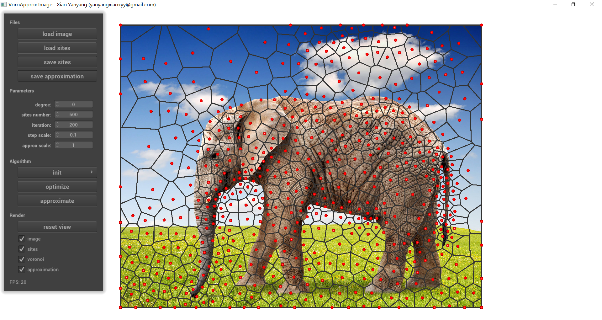
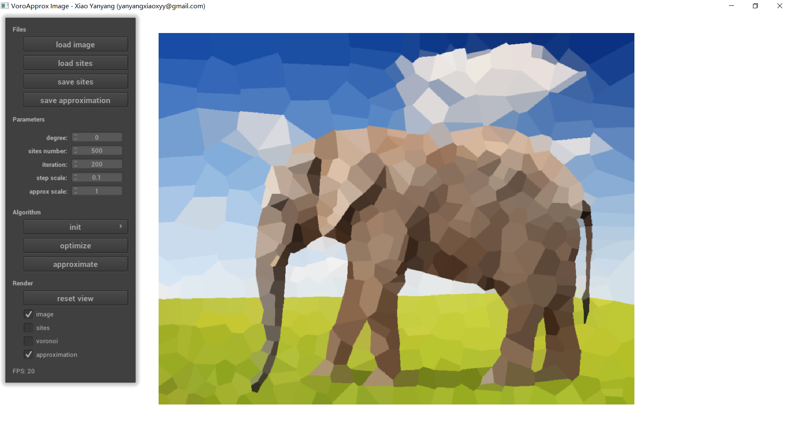
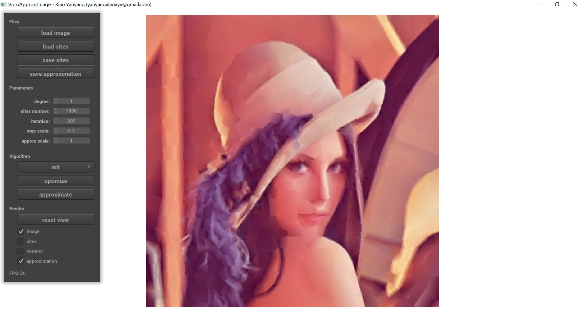

# VoroApprox
Implementation of paper "Zhonggui Chen, Yanyang Xiao, Juan Cao. Approximation by Piecewise Polynomials on Voronoi Tessellation. Graphical Models (Proc. GMP 2014), 76(5), 522-531, 2014"

if you use the code, please cite

@article{chen2014approximation,  
   title={Approximation by piecewise polynomials on Voronoi tessellation},  
   author={Chen, Zhonggui and Xiao, Yanyang and Cao, Juan},  
   journal={Graphical models},  
   volume={76},  
   number={5},  
   pages={522-531},  
   year={2014},  
   publisher={Elsevier}  
}

# Examples

# Requirements
CGAL

# Compile
Just build the project by using CMake

# Useage
(1) load image -> init -> optimize to run the algorithm;

(2) after running algorithm, click 'approximate' button to compute an approximating image;

(3) scroll mouse middle button to zoom in and out; press mouse right button with motion to translate;

(4) left Alt + scroll mouse middle button to change point size; right Alt + scroll mouse middle button to change line width;
